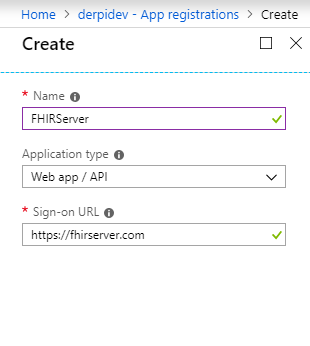
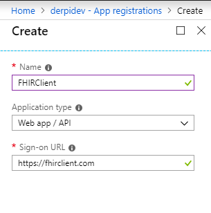
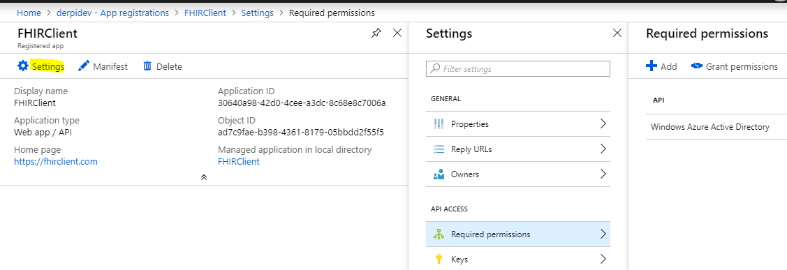
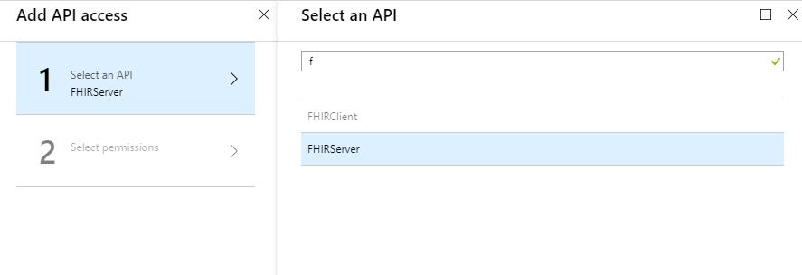
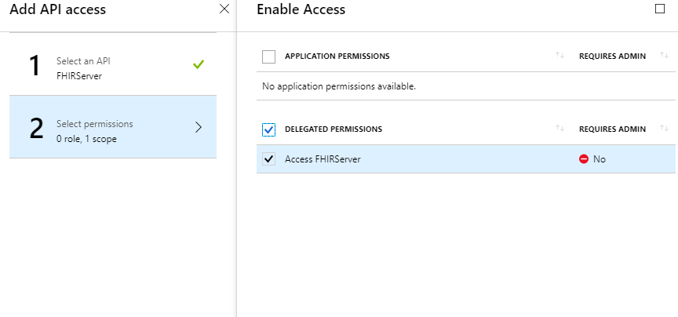
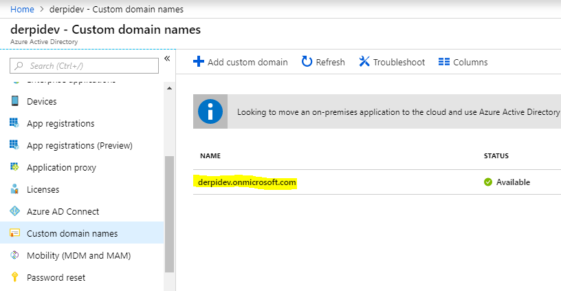

# Add OAuth Security

The Web APIs are protected with the **OAuth 2 Client Credentials** flow. We will use **Azure Active Directory \(AAD\)** for security.

## Create a FHIR Server App Registration

Open Azure Active Directory \(AAD\) and create an new `App registration` for the FHIR Server.

## Create a FHIR Client App Registration

Create another `App registration` for the FHIR Client.

## Add a Required Permission for the FHIR Client to access the FHIR Server

Open the **FHIR Client** application, and add a `Required permission` by clicking the `+Add` icon.

Select the FHIR Server for access

Then select the `Delegated Permission` as shown below. Click the 'done' icon when you are completed.

## Add a Client Secret

In the Settings section of the **FHIR Client**, click on keys and add a `ClientSecret` key. Copy the key and paste it in a secured location to use later.

## Protect the web API with OAuth

Open the Web App, click on the `Application settings` and add the following settings:

`AzureAd:ClientId` - The `Application ID` of the **FHIR Server** application.

  
`AzureAd:Domain` - The domain of your Azure Active Directory account.

`AzureAd:Instance` - The url for the Azure Active Directory security endpoints. This value should be : `https://login.microsoftonline.com/`

`AzureAd:TenantId` - The `Directory ID` of your Azure Active Directory

