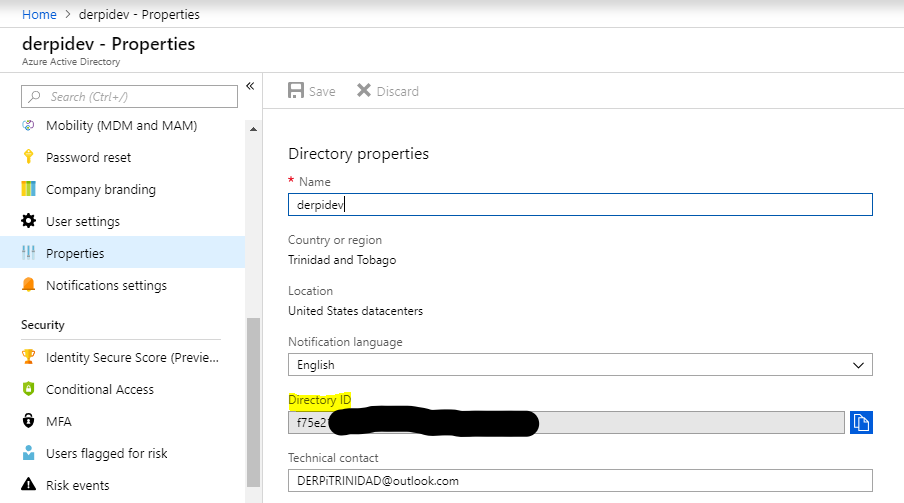

# Add OAuth Security

The Web APIs are protected with the OAuth 2 Client Credentials flow. We will use Azure Active Directory for security.

### Create a FHIR Server App Registration

Open Azure Active Directory \(AAD\) and create an new App registration for the FHIR Server.

###  Create a FHIR Client App Registration

Create another App registration for the FHIR Client.

###  Add a Required Permission for the FHIR Client to access the FHIR Server

Open the FHIR Client application, and add a required permission by clicking the '+Add' icon.

  
Select the FHIR Server for access

Then select the permission as shown below. Click the 'done' icon when you are completed.

###  Protect the web API with OAuth

Open the web app, and click on the Application settings and add the following settings:

  

