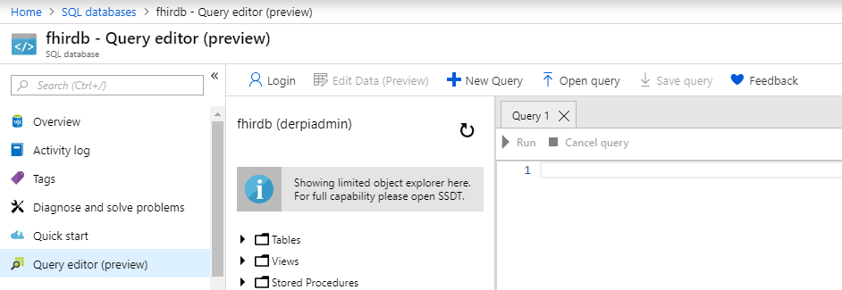
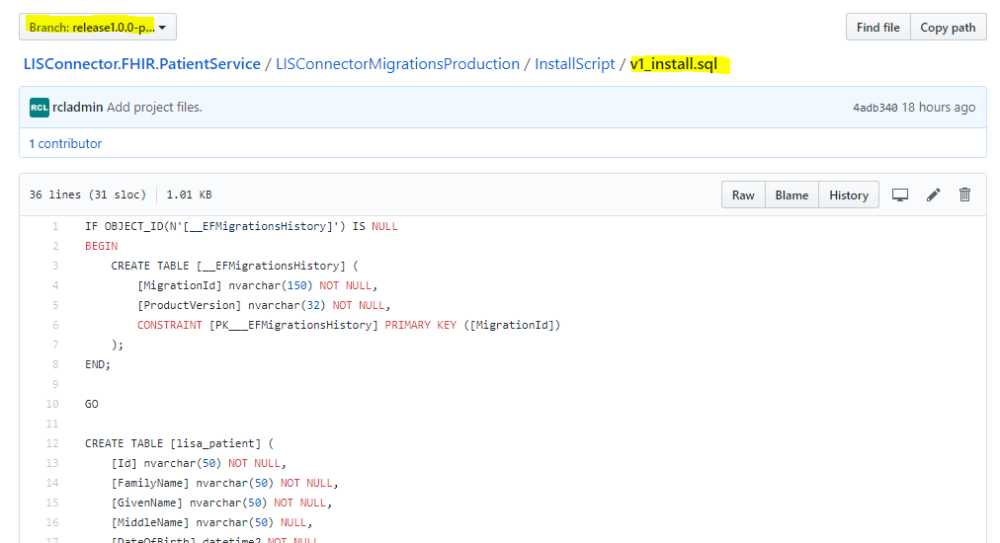
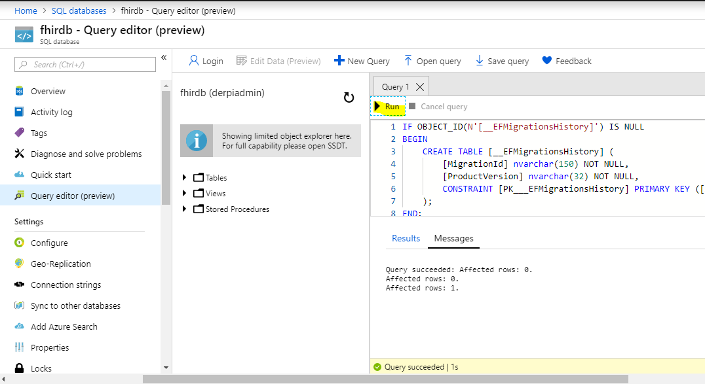
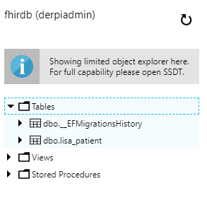
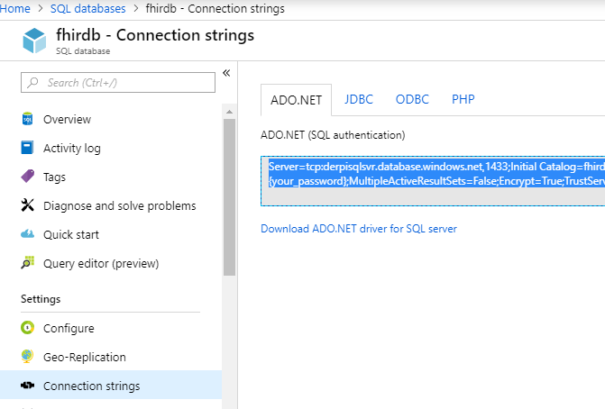
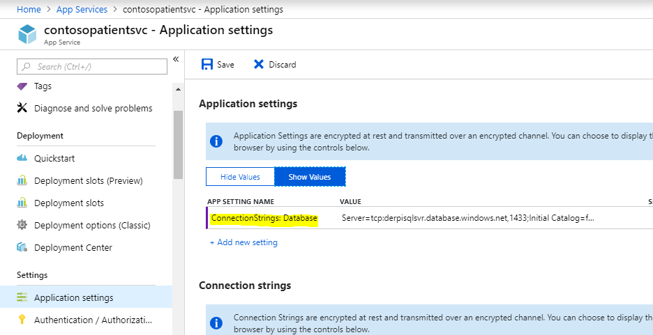

# Connect a Database

You can use a existing Azure SQL database or create a new SQL database for the applications. An install script is provided to create the tables in the database. You will also need to configure the connection string in the web app to connect to the database. You can refer to the Azure documentation to learn more about the Azure SQL databases.

### Create the database tables

Open your Azure SQL database, click on the 'Query Editor' and enter your credentials to access your database.

You will get the sql scripts in a project called  `LISConnectorMigrationsProduction` in the solution. All the API solutions will contain a project with the same name.

Copy the script from the sql script file in the `InstallScript` folder as shown below.


Please copy the sql script from the most recent 'release' branch and not 'master' to get the most stable script for the database.


Paste the sql script in the Query editor and click the 'Run' icon. The database tables will be created.

You can view the tables in the 'Tables' folder.

  
Open the database in the portal and copy the connection string. Edit the connection string to include your 'User Id' and 'Password' to connect to the database.

Open the web app and click on the Application settings, create a settings named: `ConnectionStrings: Database` , and set it value to the connection string you acquired in the last step.


Ensure you enter the connection string in the 'Application settings' section and not the 'Connection strings' section


  

