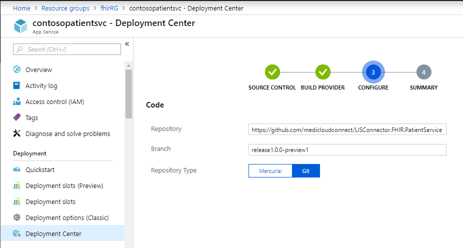

# Install the Web APIs in Azure

The FHIR Server consists of a number of decoupled ASP.NET Core Web APIs following a micro-services paradigm. In this example, we will install the 'Patient Service' API in an Azure Web App. The other APIs will follow the same process. The APIs can be found in the medicloudconnect GitHub account.



### Create a Resource Group

Create a Resource Group for your FHIR Server APIs.

### Create a Web App

In the Resource group, create a Web App for the service

### Create a Deployment

Open the Web App, and create a deployment in the 'Deployment Center', select the 'External' repository option

Use the Kudu build server for the deployment

Add the repository and branch for the deployment. Ensure that you select the most recent release branch and not 'master' to deploy a stable version of the application. You can  find the API in the medicloudconnect GitHub account.



  
Wait for the repository to build and the deploy to complete. A successful deploy will be indicated in the portal.

You can now preview the web app in the browser by clicking the URL link.

  

##   

