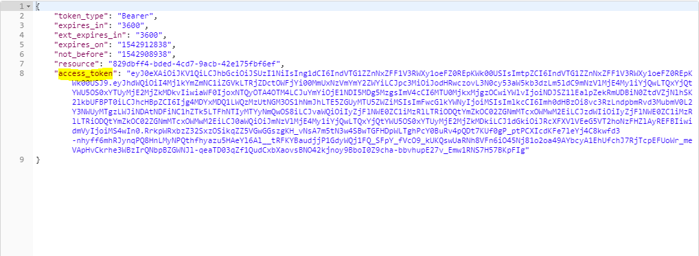
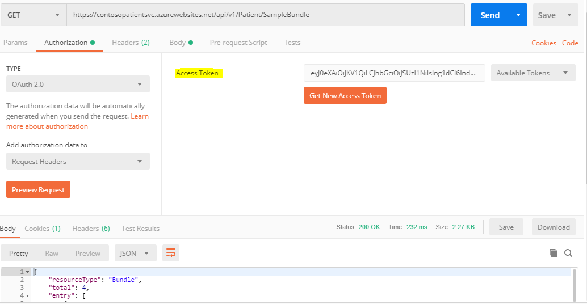
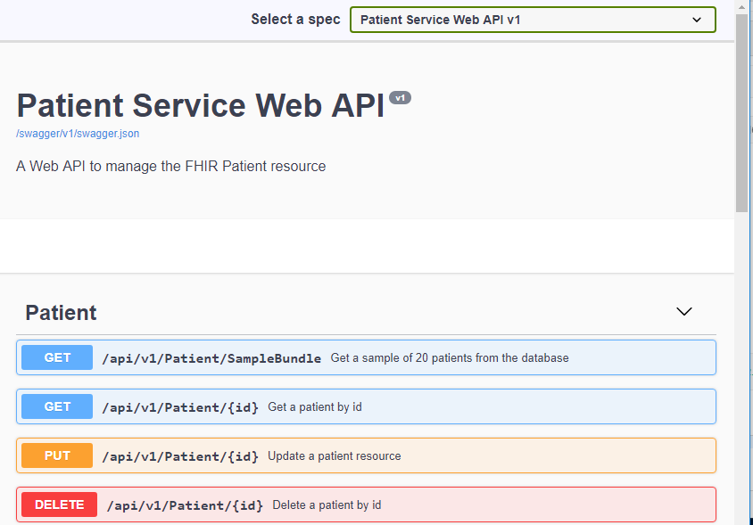

# Testing the API with Postman

You can test the APIs with the Postman application. You can download and install Postman from their site.



  
Before completing this section , you should have completed the previous section of this guide:



###  Get a JWT Token

You will need to get a JWT token to access the OAuth secured API. The token URL is in the format `https://login.microsoftonline.com/<TenantId>/oauth2/token`

The `TenantId` is the Directory ID of your Azure Active Directory \(AAD\) that was used to secure the API.

Set the following authorization parameters in the body of your `POST` request

  
`grant_type` : The is th OAuth grant type, it should be set to `client_credentials`

`client_id` : This is the Application Id of the FHIR Client application that was created in AAD

`client_secret` : This is the Client Secret of the FHIR Client

`resource` - This is the Application Id of the FHIR Server that we are trying to access from the client

  
When you send the POST request with Postman , you should get the Access Token in the response.

### Making an Authorized Request to the API

You will need to include the JWT bearer token in the header to make an authorized request to the API. Copy the JWT token.

Paste the JWT token in the Authorization section under Access Token 

You can now try the APIs. The Swagger / Open API page will provide details on the APIs. You can read the documentation and construct your requests to the APIs.

